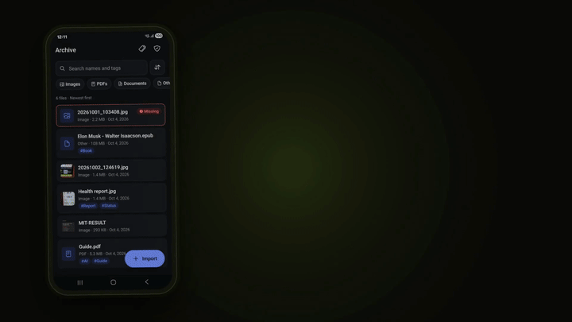
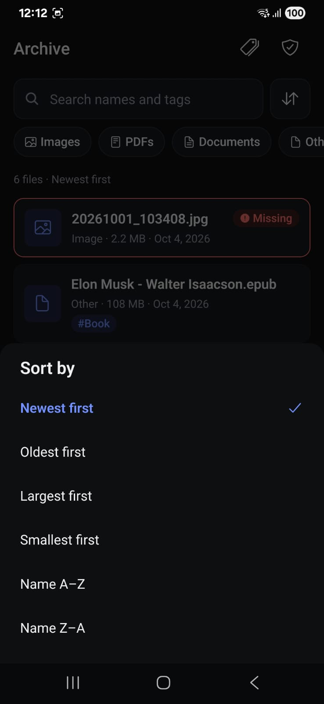
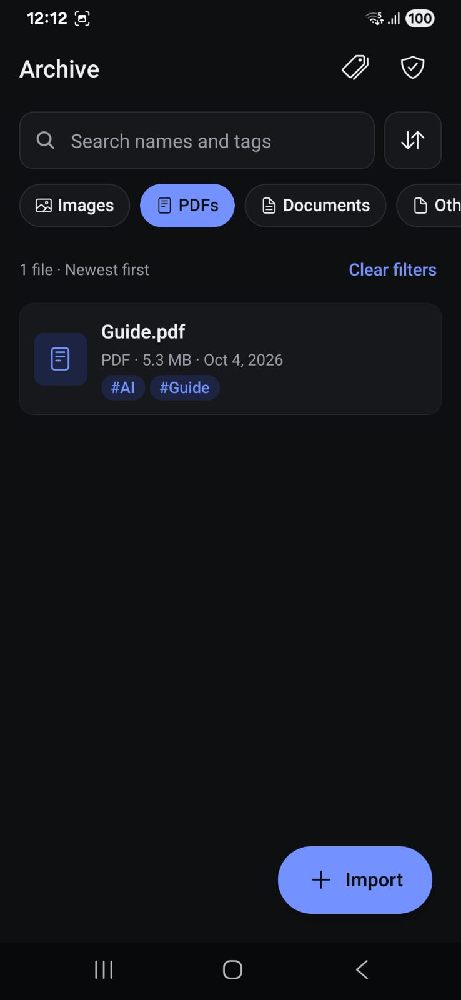
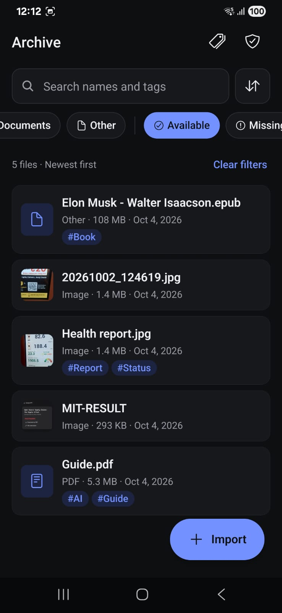

# Digital Archive

An Android app that archives images, PDFs and documents into private storage, with tags, SQL search, integrity checks and crash-safe imports.

[](demo/digital-archive-demo.mp4)

46-second demo video

## Download

**[Digital Archive v1.0.0 (APK)](https://github.com/jagpreetsingh02/app/releases/tag/v1.0.0)**

- On the phone, allow installs from unknown sources for your browser or file manager, then open the APK.
- The debug tools (simulate external deletion, simulate a crash mid-import) exist only in development builds, not in this APK.

## Features

- **Import** many files at once with per-file progress, cancel, and a summary (imported / duplicates / failed with reason).
- **Categories:** images, PDFs and documents (txt, md, csv, doc/docx, xls/xlsx, ppt/pptx, odt, rtf, json); anything else is stored as "Other".
- **Metadata:** name, original name, MIME type, size, import date, picker modification date, last known modification date, tags, storage path, SHA-256, availability.
- **Organise:** create and delete tags, tag and untag files, rename, remove (with a confirmation that says exactly what is deleted).
- **Search and filter**, all in SQL: name or tag text, category, availability, single tag; sort by date, size or name.
- **Availability:** each entry is `available`, `missing` or `unreadable`; checked in the background on launch and on foreground, and on demand.
- **Open** images in-app and other files in an external viewer. **Re-link** a missing file by picking it again (only accepted if the hash matches). **Integrity scan** with counts and a problem list.
- Light and dark mode, 48dp touch targets, screen-reader labels, WCAG AA contrast.

## Screenshots

| | | |
|:-:|:-:|:-:|
|  |  |  |
| Archive list | Filter | File detail |
|  |  |  |
| Missing entry | Tags | Integrity scan |
|  |  |  |
| Sort options | PDF filter | Availability filter |

## Architecture

Expo SDK 57 · React Native 0.86 · TypeScript · Expo Router · expo-sqlite · expo-file-system · zustand · Jest

```
app/            routes (Expo Router)            ─┐
src/ui/         screens, components             ─┤ no SQL, no file-system calls
src/state/      zustand stores                  ─┘
      │ calls
src/services/   ImportService, ReconciliationService, AvailabilityService,
                RelinkService, OpenService, SearchService, TagService, ArchiveService
      │ depend only on interfaces
src/data/       SQLite schema + migrations, repositories, search query   (all SQL)
src/storage/    FileStore (copy, move, stat, hash), picker, external viewer (all file I/O)
src/domain/     pure types, errors, file classification
src/bootstrap.ts   the only place concrete classes are wired together
```

- **`app/`, `src/ui/`** render screens and call services; they never touch SQL or files.
- **`src/state/`** holds UI state: import progress, filters, scan progress.
- **`src/services/`** hold the business rules and depend on the `FileRepository`, `TagRepository` and `FileStore` interfaces, so tests inject fakes that fail on demand.
- **`src/data/`** is the only place with SQL. In tests the same SQL runs on Node's built-in `node:sqlite` (the same engine), not a mock.
- **`src/storage/`** is the only place that touches the file system.

## Storage strategy

- **Files are copied into app-private storage** (`<documents>/archive/<id>.<ext>`) and the app owns that copy. A picked Android `content://` URI is only temporarily readable, so a stored reference would break after a restart or when the user moves the file. The user's original is never opened for writing.
- **Paths are stored relative** (`archive/<id>.pdf`) and resolved at runtime, because the absolute container path can change after an app update or restore.
- **Schema** (`src/data/schema.ts`, migrated with `PRAGMA user_version`, foreign keys on):
  - `files`: id, display/original name, MIME type, category, size, import date, picker and last-known modification dates, relative `storage_path` (unique), content hash, `status` (`available`/`missing`/`unreadable`), last check time.
  - `tags`: id, name (unique, case-insensitive).
  - `file_tags`: file ↔ tag, both `ON DELETE CASCADE`.
- **"Remove from archive"** deletes the entry and the archive's private copy. **The user's original file is not affected**; the confirmation dialog says exactly this. The row is deleted before the file, so a crash in between can only leave a stray file, which startup cleanup deletes.

## Import pipeline

`src/services/ImportService.ts`. Two files at a time; each file goes through:

1. **Validate** the source: it exists, is readable, and its size is > 0.
2. **Copy** to `archive/.staging/<id>.part`.
3. **Verify** the copied size, then compute the **content hash** (SHA-256; files over 50 MB use a fingerprint of size + first and last 1 MB).
4. **Duplicate check:** same hash and same size as an existing record → reported as a duplicate, with *Keep anyway*.
5. **Atomic move** to `archive/<id>.<ext>`.
6. **Insert the database row** in one exclusive transaction. If it fails, the moved file is deleted.
7. **Report** imported / duplicate / failed (with reason). One failure never stops the others.

**Why the record is inserted last:** at step 6 the file is complete and already at its final path, and a failed insert deletes it again. So the database can never contain a record for a file that was not fully imported. A crash can only leave files on disk without a record.

**Crash recovery on startup** (`src/services/ReconciliationService.ts`, runs in the background): delete everything in `archive/.staging/`, delete files in `archive/` that have no database row, and clear the picker's cache copies. It never rescans the device and never creates records. Imports wait on the same lock, so cleanup can never delete a file an import has just moved into place.

## Edge cases

Tests are in `__tests__/`.

| Case | What the app does | Test |
|---|---|---|
| Import cancelled | Finished files kept, in-flight staging copy deleted, the rest reported as cancelled | `import.test.ts` |
| Source unreadable | Fails with the real system reason; nothing written | `import.test.ts`, `expoFileStore.test.ts` |
| Empty file | Fails: "The selected file is empty." | `import.test.ts` |
| Copy fails | Partial `.part` deleted, no record | `import.test.ts` |
| Database insert fails | Moved file deleted, no record | `import.test.ts` |
| Partial success (3 files, middle fails) | 2 imported, 1 failed with reason | `import.test.ts` |
| App killed during copy | `.part` deleted at next launch | `import.test.ts` |
| App killed between move and insert | Orphan file deleted at next launch | `import.test.ts` |
| Startup cleanup during an import | Cleanup waits on the shared lock | `import.test.ts` |
| Duplicate (same batch or already archived) | Reported as duplicate; *Keep anyway* imports a separate copy | `import.test.ts`, `services.test.ts` |
| Archived file deleted externally | Marked `missing`; metadata and tags kept; re-link offered | `availability.test.ts`, `debug.test.ts` |
| Archived file unreadable or size changed | Marked `unreadable` with a reason | `availability.test.ts` |
| File cannot be opened | Friendly message; marked `unreadable` (unless no viewer app is installed) | `open.test.ts` |
| Re-link with the wrong file | Refused, nothing changed | `relink.test.ts` |
| Remove when the file delete fails | Record already gone; leftover deleted at next launch | `services.test.ts` |
| Search text with `%`, `_` or SQL | Matched literally; bound as parameters | `search.test.ts` |
| User moves or deletes their original | No effect: the archive owns its copy | — |

## Run, test and build

```bash
npm install
npm run typecheck                                            # app + tests
npm test                                                     # 89 tests, 10 suites

npx eas-cli@latest login
npx eas-cli@latest build -p android --profile development   # dev build (Expo Go is not supported)
npx expo start --dev-client

npx eas-cli@latest build -p android --profile preview       # release APK
```

## Known limitations

- **Android only.** The iOS code paths exist but have not been tested on a device.
- **Expo Go can't run it.** Expo Go blocks reading the picker's file copies, so a development build is required.
- **Large-file duplicate check:** files over 50 MB use a fingerprint (size + first and last 1 MB), which could in theory call two different files duplicates. *Keep anyway* still imports it.
- **Step-level progress only:** the picker first copies each file into the app cache, so a very large file briefly needs twice its size and pauses before progress appears.
- **The archive lives in app-private storage**, so uninstalling the app deletes it; there is no export or backup.
