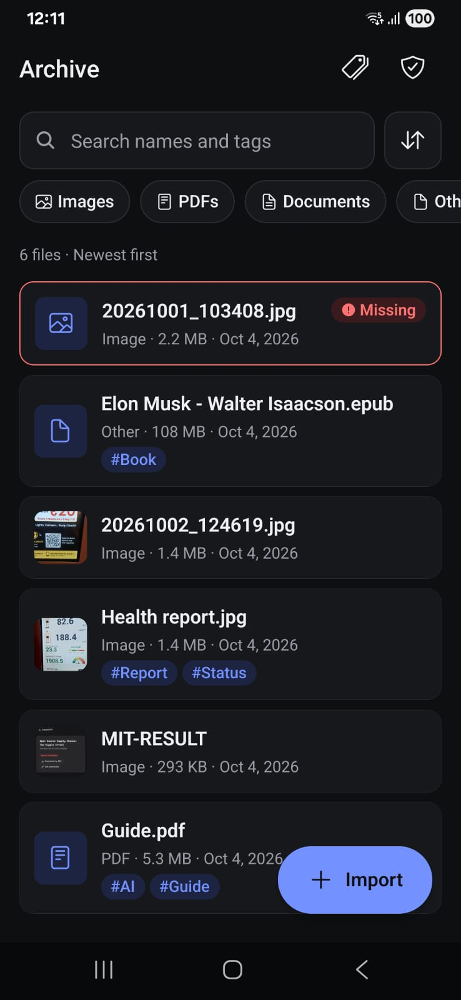
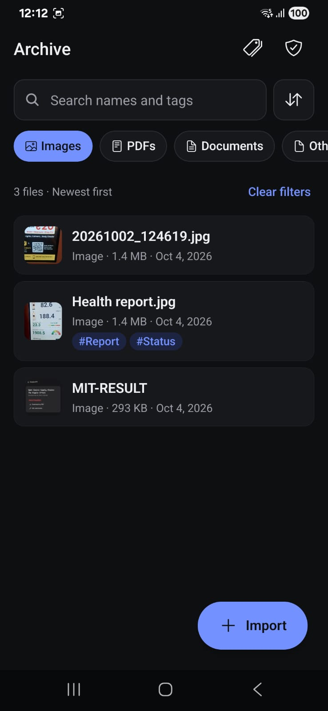
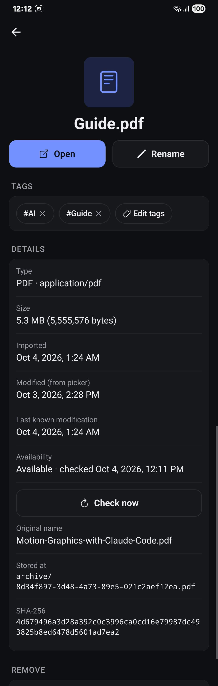
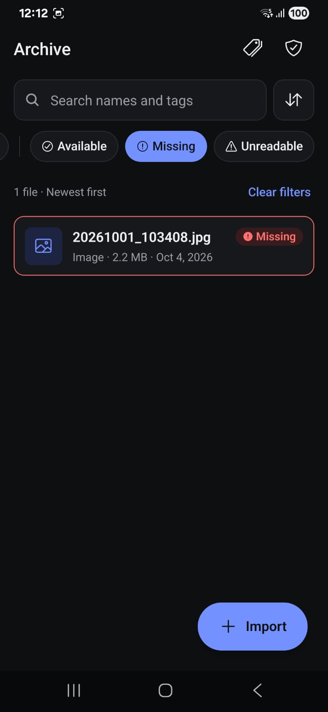
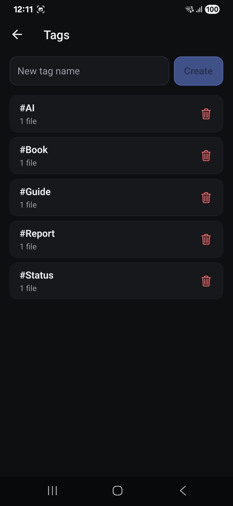
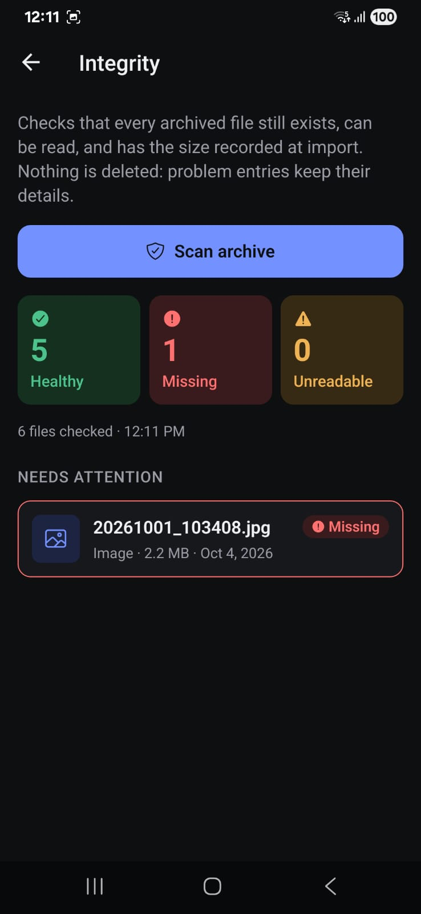

# Digital Archive

An Android app that keeps a personal archive of files: images, PDFs and documents, with tags, search and integrity checks. Built for GDG on Campus SRM (App Development, Task 1).

The archive survives restarts, never leaves a half-imported file in its database, and keeps every entry's details visible even when the underlying file goes missing.

**Stack:** Expo SDK 57 · React Native 0.86 · TypeScript · Expo Router · expo-sqlite · expo-file-system (object API) · zustand · Jest

---

## Screenshots

| | | | |
|---|---|---|---|
|  |  |  |  |
| Archive list | Search + filter | Import progress | Summary with a failure |
|  |  |  |  |
| File detail | Missing entry | Tags | Integrity scan result |

---

## Features

- **Import** many files at once from the system picker. Any type can be imported; images, PDFs and documents (txt, md, csv, doc/docx, xls/xlsx, ppt/pptx, odt, rtf, json) are categorised, and every other type is stored as "Other". Imports show live progress for each file, can be cancelled, and end with a summary: imported, duplicates, and failed with a reason.
- **Metadata per file:** display name, original name, MIME type and category, size, import date, the modification date reported by the picker, last known modification date, tags, storage location, content hash, and availability status with the time of the last check.
- **Organise:** create and delete tags, add and remove tags on files, rename an entry, and remove an entry (with a confirmation that says exactly what is deleted).
- **Search and filter**, all in SQL against the database:
  - text search across file names *and* tag names;
  - filter by category, by availability, and by a single tag;
  - sort by date, size or name.
- **Availability:** each entry is `available`, `missing` or `unreadable`. Checks run in the background on launch and whenever the app returns to the foreground, and on demand per file.
- **Open:** images open in an in-app viewer; PDFs and documents open in an external viewer app.
- **Re-link:** restore a missing entry by picking the same file again. It is accepted only if the content hash matches.
- **Integrity scanner:** scans the whole archive with progress, shows healthy / missing / unreadable counts, and lists the problem files.
- **Duplicate detection** using size plus content hash, with a *Keep anyway* option.
- **UI:** light and dark mode, 48dp touch targets, screen-reader labels, WCAG-AA text contrast, and loading, empty, no-results and error states on every screen.

---

## Architecture

```
app/                 Expo Router routes: thin, they only compose ui/ screens
src/
  domain/            Pure types, enums, errors, file classification. No dependencies.
  data/              SQLite: schema + migrations, FileRepository, TagRepository,
                     search query builder. ALL SQL lives here.
  storage/           FileStore interface + ExpoFileStore (copy, move, delete, stat,
                     hash, list), document picker, external viewer. ALL file-system
                     access lives here.
  services/          ImportService, ReconciliationService, AvailabilityService,
                     RelinkService, OpenService, SearchService, TagService,
                     ArchiveService. Business rules; depend only on interfaces.
  state/             zustand stores: import progress, filters, scan progress,
                     archive change counter.
  ui/                Screens and components. No SQL, no file-system calls.
  bootstrap.ts       Composition root: the only file that wires concrete classes.
```

```
        ┌──────────── ui/ + app/ ────────────┐
        │  screens, components, hooks        │
        └───────┬───────────────┬────────────┘
                │ calls         │ reads/writes
                ▼               ▼
         services/          state/ (zustand)
         ImportService, AvailabilityService, …
           │                     │
           ▼ interfaces          ▼ interfaces
   FileRepository / TagRepository     FileStore
           │                     │
           ▼                     ▼
   data/ (expo-sqlite)     storage/ (expo-file-system)
```

Services depend on the `FileRepository`, `TagRepository` and `FileStore` **interfaces**, never on Expo modules. That is what makes the failure tests possible:
- an in-memory `FileStore` can fail any operation on demand;
- a wrapper around the real repository can make the database insert fail.

The repositories run against a small `SqlDatabase` interface. In the app it is backed by expo-sqlite. In Jest it is backed by Node's built-in `node:sqlite`, the same SQLite engine, so schema constraints, cascades and the search SQL are tested for real rather than mocked.

---

## Storage strategy

**The app copies every imported file into its own private storage and owns that copy.**

| | |
|---|---|
| Archived files | `<documents>/archive/<id>.<ext>` |
| In-progress copies | `<documents>/archive/.staging/<id>.part` |
| Database | `archive.db` (expo-sqlite default location) |

Why copy instead of referencing the user's file:
- On Android, a picked file is a `content://` URI whose permission is temporary. A stored reference would stop working after a restart or when the user moves the file.
- Owning a copy means the archive is the source of truth, and a device rescan is never needed.
- The user's original is never opened for writing, so it can never be modified or deleted by the app.

**Relative paths.** The `storage_path` column is relative (`archive/<id>.pdf`) and is resolved against the documents directory at runtime. The absolute container path can change after an app update or restore, and a relative path keeps working.

**Schema** (`src/data/schema.ts`, migrated with `PRAGMA user_version`; each migration runs in a transaction together with its version bump):

| Table | Columns |
|---|---|
| `files` | `id` (uuid PK), `display_name`, `original_name`, `mime_type`, `category` (CHECK), `size_bytes`, `imported_at`, `source_modified_at`, `last_known_modified_at`, `storage_path` (UNIQUE), `content_hash`, `status` (CHECK `available`/`missing`/`unreadable`), `status_checked_at` |
| `tags` | `id`, `name` (UNIQUE, `COLLATE NOCASE`), `created_at` |
| `file_tags` | `file_id` → files ON DELETE CASCADE, `tag_id` → tags ON DELETE CASCADE, composite PK |

Indexes cover display name, category, status, import date, size, `(content_hash, size_bytes)`, and `file_tags.tag_id`. `PRAGMA foreign_keys = ON` is set on every connection.

**What "Remove from archive" does.** It deletes the entry *and the archive's private copy* from the app. **The user's original file on the device is not affected.** The confirmation dialog says exactly this. The database row is deleted first, then the file. If the app dies in between, the leftover file has no record, and startup reconciliation deletes it. The reverse order could leave a record pointing at a deleted file.

**Deleting a tag** removes it from every file (by cascade). The files themselves stay in the archive.

---

## The import pipeline

`src/services/ImportService.ts`. Files are processed two at a time, off the UI thread (copying and hashing are async native calls). For each file:

| # | Step | On failure |
|---|---|---|
| 1 | **Validate** the source: it exists, is readable, and size > 0 | `failed (SOURCE_UNREADABLE / SOURCE_EMPTY)`, nothing written |
| 2 | **Copy** to `archive/.staging/<id>.part` | staging file deleted, `failed (COPY_FAILED)` |
| 3 | **Verify** the copied size equals the source size, then compute the **content hash** | staging deleted, `failed (SIZE_MISMATCH / HASH_FAILED)` |
| 4 | **Duplicate check:** is there a record with the same hash *and* size? | if yes: staging deleted, reported as `duplicate of X` |
| 5 | **Atomic move** (same-volume rename) to `archive/<id>.<ext>` | staging deleted, `failed (MOVE_FAILED)` |
| 6 | **Insert the DB row** in one exclusive transaction | **compensation:** the moved file is deleted, `failed (DB_FAILED)` |
| 7 | **Report** `imported` / `duplicate` / `failed(reason)` | — |

**Why the record is inserted last.** At step 6 the file is complete, verified, and already at its final path. If the insert succeeds, the record points at a real file. If it fails, the file is deleted again. So the database can never contain a record for a file that was not fully imported. Anything a crash can leave behind exists **on disk only**: a `.part` file, or an archived file with no row. Both are cleaned up by reconciliation (below).

Further rules:
- **Cancellation.** A cancel token is checked before every step. On cancel, the in-flight file's staging copy is deleted, files that haven't started are reported as cancelled, and files that already finished are kept.
- **Partial success.** Each file's outcome is independent; one failure never aborts or rolls back the others. The summary counts imported, duplicates, failed and cancelled.
- **Steps 4–6 run one file at a time.** Copying and hashing happen in parallel, but if two identical files went through the duplicate check concurrently, both would pass before either was inserted.
- **Exclusive transaction.** `withExclusiveTransactionAsync` is used for the insert. expo-sqlite's `withTransactionAsync` is documented as letting unrelated queries run inside it.
- **Picker cache copies.** The picker hands us its own cache copy of each file (`copyToCacheDirectory: true`). That copy is deleted as soon as the file has a final outcome. Duplicates keep it until the import sheet is closed, so *Keep anyway* still works. Leftovers are cleared at startup. The delete call refuses any path outside the picker's cache folder.

---

## Crash and restart recovery

`ReconciliationService` runs on **every launch, in the background**; the first screen renders without waiting for it. It:

1. deletes everything in `archive/.staging/` (copies interrupted by a crash or kill);
2. deletes every file in `archive/` that has no database row (the app died between step 5 and step 6);
3. empties the document picker's cache folder.

It only trims the disk to match the database. It **never rescans the device and never creates records**: the database is the source of truth.

Reconciliation and imports share an **archive lock** (a small async mutex). An import started immediately after launch waits for cleanup to finish, so cleanup can never delete a file an import has just moved into place. There is a test that starts cleanup at exactly that moment.

---

## Availability handling

`AvailabilityService` classifies each record:

| Status | Meaning |
|---|---|
| `available` | The archived copy exists, has the recorded size, and can be read |
| `missing` | The archived copy is gone (deleted by another app, storage cleared) |
| `unreadable` | It exists but cannot be read, its size has changed (truncated or replaced), stat fails, or opening it failed |

- **When checks run.** In batches of 25 in the background after startup cleanup, again whenever the app returns to the foreground (at most once a minute), on demand from *Check now* on a file, before every *Open*, and from the Integrity screen.
- **The UI never waits.** Scans yield to the event loop between batches, and concurrent scan requests share one run.
- **Records are never deleted or altered because a file is gone.** Only `status`, `status_checked_at` and `last_known_modified_at` change. Name, tags, hash, size and dates stay visible.
- **Stale results are ignored.** A status update only applies if its check is newer than the one recorded, so a slow scan cannot overwrite a fresher result (such as a re-link).
- **Opening a file never crashes.** Each outcome:
  - Missing or unreadable at open time: a friendly message, and the status is updated.
  - The viewer fails to launch, or an in-app image fails to decode: the entry is marked `unreadable` and the reason is shown.
  - The file is healthy but no installed app handles its type: the message says so, and the entry is *not* blamed.
- **Re-link** (missing or unreadable entries). The user picks the file again:
  - A different size is rejected straight away.
  - Otherwise the file is copied to staging and hashed. It is accepted only if the hash equals the record's; then it is atomically moved into the original path and the status becomes `available`.
  - On any mismatch the user is told and **nothing changes**.
- **Moving the original has no effect.** Because the archive owns a copy, deleting or moving the user's original file does not affect the archive. "Missing" means the archive's own copy was removed.

---

## Duplicate detection

A file is a duplicate if a record has the **same content hash and the same size**.

- Files up to **50 MB** get a full **SHA-256** (`sha256:<hex>`).
- Larger files get a **fingerprint**: SHA-256 over the size plus the first and last 1 MB (`fp:<hex>`).

**Trade-off.** Hashing a multi-hundred-MB video in full would mean reading it all into memory, which is slow and risks running out of memory on low-end phones. The fingerprint is fast and constant-memory. The cost: two *different* large files with identical size, first MB and last MB would be called duplicates. That is very unlikely for real files, and the user can still choose *Keep anyway*. The prefixes ensure a full hash is never compared with a fingerprint.

The import never pauses to ask about a duplicate. The summary shows "Duplicate of “X” — not imported" with a *Keep anyway* button that imports it as a separate entry.

---

## Edge cases

| Case | What the app does | Tested |
|---|---|---|
| User cancels the picker | Nothing happens | — |
| User cancels mid-import | In-flight staging copy deleted; finished files kept; remaining files reported as cancelled | `import.test.ts` |
| Source unreadable (permission, revoked URI) | `failed: The selected file could not be read: <native reason>`; nothing written | `import.test.ts`, `expoFileStore.test.ts` |
| Empty (0-byte) file | `failed: The selected file is empty.` | `import.test.ts` |
| Copy fails (I/O error, disk full) | Partial `.part` deleted; no record | `import.test.ts` |
| Copied size ≠ source size | `failed (SIZE_MISMATCH)`; staging deleted | — |
| Hashing fails | Staging deleted; `failed (HASH_FAILED)`; other files continue | `import.test.ts` |
| Database insert fails | **Compensation:** moved file deleted; no record | `import.test.ts` |
| App killed during copy / hash | `.part` left in staging → deleted at next launch | `import.test.ts` |
| App killed between move and insert | File with no record → deleted at next launch | `import.test.ts`, debug simulator |
| App killed after insert | Import is complete; nothing to clean | — |
| Startup cleanup races a fresh import | Shared archive lock: the import waits | `import.test.ts` |
| Partial success (3 files, middle fails) | 2 imported, 1 failed with reason; order preserved | `import.test.ts` |
| Duplicate (same batch or already archived) | Reported as duplicate; *Keep anyway* available | `import.test.ts`, `services.test.ts` |
| Archived file deleted externally | `missing`; metadata and tags retained; re-link offered | `availability.test.ts`, debug simulator |
| User moves or deletes their *original* | No effect: the archive owns a copy | — |
| Archived file inaccessible / unreadable | `unreadable` with a reason | `availability.test.ts` |
| Archived file truncated or replaced (size changed) | `unreadable` | `availability.test.ts` |
| File cannot be opened | Friendly message; marked `unreadable` (unless simply no viewer app exists) | `open.test.ts` |
| Re-link with the wrong file | Refused ("Not the same file"); nothing changed | `relink.test.ts` |
| Rename to empty / too long | Inline validation error | `services.test.ts` |
| Duplicate tag name (any case) | "A tag named “X” already exists." | `services.test.ts` |
| Search text with `%`, `_` or SQL | Treated literally; parameters only | `search.test.ts` |
| Database cannot open | Error screen with *Try again* instead of a crash | — |
| Remove: file deletion fails | Record already gone; leftover file deleted at next launch | `services.test.ts` |

---

## How to run

Requirements: Node 20+ (developed on Node 24), an Android phone, and a free [Expo](https://expo.dev) account.

```bash
npm install
npm run typecheck        # tsc for app + tests
npm test                 # 89 Jest tests
```

**Expo Go cannot run this app.** Expo Go confines file access to its own per-project folder, while the document picker writes its copies into Expo Go's shared cache. Reading a picked file therefore fails with `ERR_INVALID_PERMISSION`. Use a development build instead:

```bash
npx eas-cli@latest login
npx eas-cli@latest build -p android --profile development   # install the APK it produces
npx expo start --dev-client                                  # open "Digital Archive" on the phone
```

### Build the release APK

```bash
npx eas-cli@latest build -p android --profile preview
```

The `preview` profile in `eas.json` produces an installable `.apk` (`android.buildType: "apk"`). Open the build link on the phone to download and install it.

### Debug tools (development builds only)

In a development build, a bug icon in the Archive header opens **Debug tools**:
- **Simulate external deletion** deletes an entry's archived copy, keeping its record.
- **Crash during next import** stops the next import between the move and the database insert, skipping cleanup. Restart the app to watch reconciliation remove the leftover file.

These are guarded by `__DEV__`. The debug screen and service are loaded through `__DEV__`-guarded `require`s, which Metro removes from production builds. A production `expo export` contains none of their code or text.

### Regenerate the icons

The app icon, adaptive icon and splash image are original artwork generated from simple shapes:

```bash
python3 scripts/generate_icons.py   # needs Pillow
```

---

## Known limitations

- **Android-first.** Built and tested on Android. The iOS code paths (share-sheet viewer) exist but have not been tested on a device.
- **No Expo Go** (see above); a development build is required.
- **Debug tools exist only in development builds.** The edge-case demos (external deletion, crash mid-import) cannot be triggered from the release APK. Killing the app mid-import with the app switcher still works.
- **Step-level progress only.** `File.copy()` has no byte-progress callback, so progress moves through the pipeline steps rather than bytes copied.
- **Double copy on import.** The picker copies each file into the app cache before our pipeline starts. A very large file pauses before progress appears and briefly needs twice its size in free space. The cache copy is deleted afterwards.
- **Fingerprint duplicates** for files over 50 MB can, in theory, give a false positive (see *Duplicate detection*).
- **Search uses `LIKE '%text%'`,** which scans the files table instead of using an index. That is fine for thousands of entries; full-text search (FTS5) would be the next step for much larger archives.
- **Modification date from the picker** is shown as "Not provided by the device" when Android reports none.
- **Status is as of the last check.** If a file is deleted while the app is open, it shows as available until the next check: on foreground, *Check now*, *Open*, or a scan.
- **Uninstalling the app deletes the archive** (it lives in app-private storage). There is no export or backup feature; it was out of scope.
- **"No viewer app"** is not counted as unreadable, because the file is fine. Every other open failure is.
